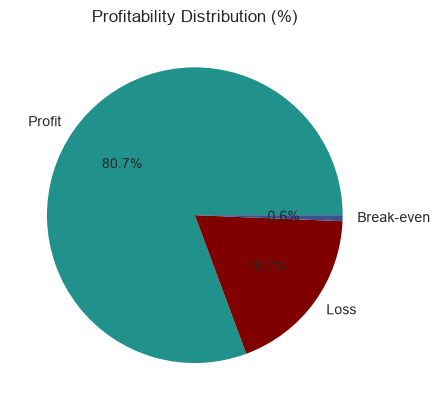
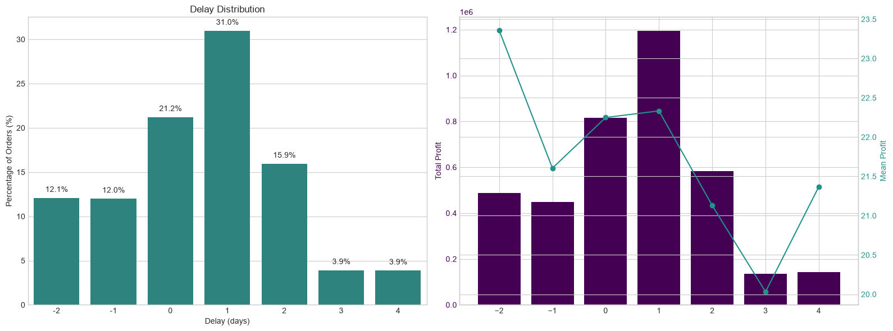
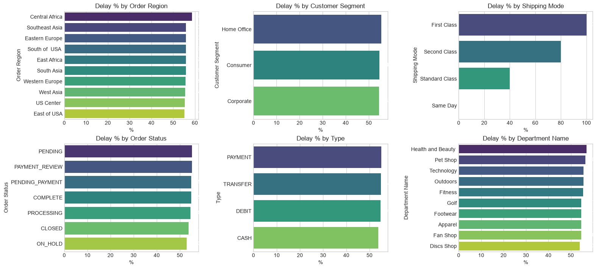
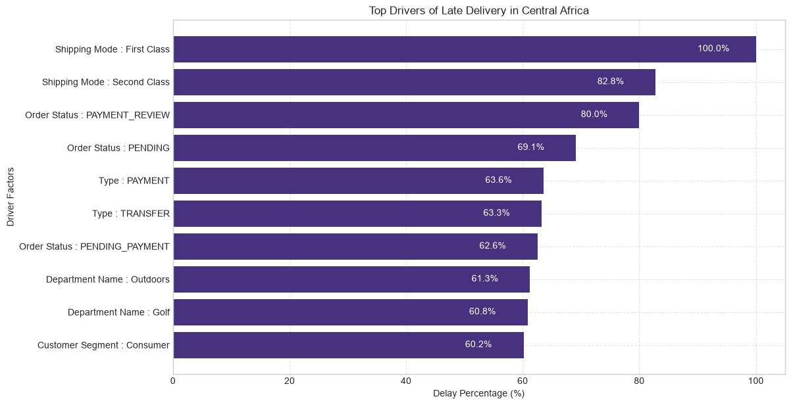
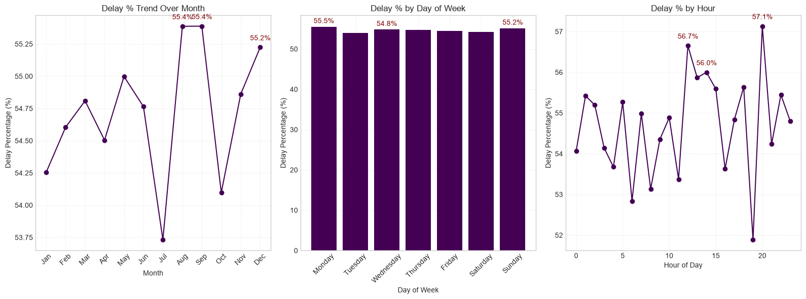

<div align="center">

# 📦 SUPPLY CHAIN ANALYTICS

### End-to-End Supply Chain Analysis using Python, SQL & Power BI


</div>

---

# 📌 About the Project

This project is an **end-to-end Supply Chain Analytics project** designed to analyze operational performance, profitability, delivery efficiency, bottlenecks, root causes, and time-based patterns across a supply chain.

The project combines **Python, SQL, and Power BI** to transform raw supply chain data into meaningful business insights.

The analysis focuses on identifying:

- Profitability patterns
- Delivery performance issues
- Operational bottlenecks
- Root causes behind performance problems
- Time-based trends
- Areas of operational inefficiency
- Factors affecting overall supply chain performance

The goal is to demonstrate how data analytics can be used to move from **raw data → analysis → visualization → business insights**.

---

# 🎯 Business Problem

Supply chain operations generate large amounts of data across orders, products, customers, shipping, costs, delivery times, and profitability.

However, raw data alone does not clearly answer important business questions such as:

- Which areas are contributing most to profitability?
- Where are delivery problems occurring?
- Which stages of the supply chain create bottlenecks?
- What are the major causes behind operational issues?
- How does performance change over time?
- Which factors should management investigate further?

This project addresses these questions through structured data analysis and visualization.

---

# 🎯 Project Objectives

The major objectives of this project are:

1. Analyze overall supply chain performance.
2. Understand profitability patterns.
3. Evaluate delivery performance.
4. Identify operational bottlenecks.
5. Perform root-cause analysis.
6. Analyze time-based performance patterns.
7. Generate actionable business insights.
8. Build a clear analytical workflow using Python, SQL, and Power BI.

---
# 📊 Analysis & Visualizations

This section presents the five major analytical outputs from the Supply Chain Analytics project.

---

## 💰 1. Profitability Analysis

The profitability analysis examines profitability patterns across the supply chain.



---

## 🚚 2. Delivery Performance Analysis

The delivery performance analysis examines delivery-related patterns and operational performance.



---

## 🚧 3. Bottleneck Analysis

The bottleneck analysis identifies operational constraints and potential areas of supply chain inefficiency.



---

## 🔍 4. Root-Cause Analysis

The root-cause analysis investigates factors associated with supply chain performance issues.



---

## ⏱️ 5. Time-Based Analysis

The time-based analysis examines how supply chain performance changes across different periods.



---

# 🔍 Key Business Questions

The project investigates questions such as:

- What factors influence supply chain profitability?
- Which areas show delivery performance issues?
- Where are the major operational bottlenecks?
- What are the possible root causes of performance problems?
- How does supply chain performance vary over time?
- Which operational areas require further investigation?
- How can data support better supply chain decision-making?

---

# 🛠️ Tools & Technologies

| Tool | Purpose |
|---|---|
| 🐍 Python | Data analysis and processing |
| 🐼 Pandas | Data cleaning and manipulation |
| 🔢 NumPy | Numerical analysis |
| 📊 Matplotlib | Data visualization |
| 📈 Seaborn | Statistical visualization |
| 🗄️ SQL | Data querying and analysis |
| 📊 Power BI | Interactive business dashboards |
| 📓 Jupyter Notebook | Analysis and documentation |
| 🐙 GitHub | Project version control and portfolio |

---

# 🔄 Analytical Workflow

```text
Raw Supply Chain Data
        ↓
Data Cleaning
        ↓
Data Transformation
        ↓
Exploratory Data Analysis
        ↓
SQL-Based Analysis
        ↓
Python Visualization
        ↓
Root Cause Analysis
        ↓
Time-Based Analysis
        ↓
Power BI Dashboard
        ↓
Business Insights
